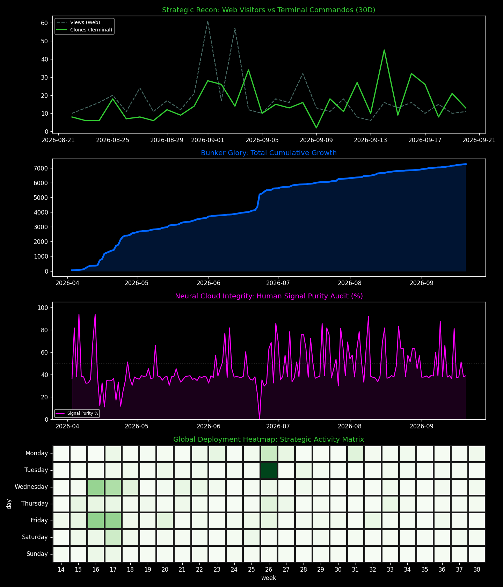
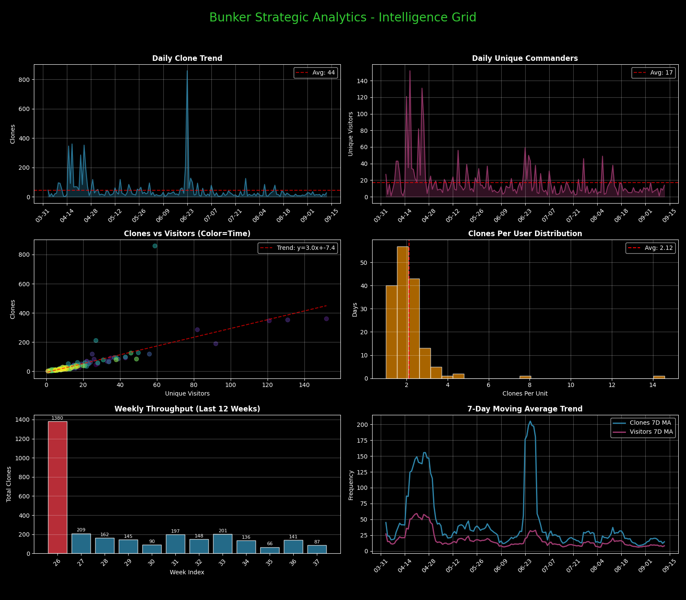
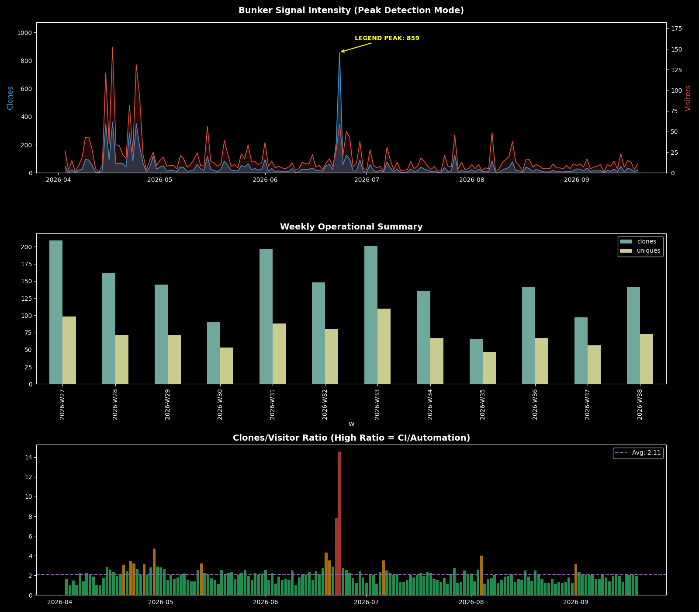
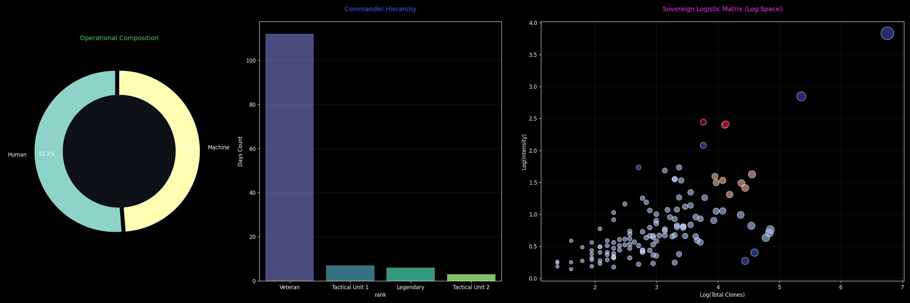

# 🛰️ 地堡终极运行报告 (Sovereign Dashboard v8.5)
## 📊 核心战力指标
- **累计物理克隆**: `6837` 次
- **社群声望**: ⭐ `3` / 🍴 `0`
- **地堡协议防护**: AGPL-3.0 生效中

### 🖥️ 1. 实时作战看板 (Visual Radar)

### 🔍 2. 战略情报大屏 (Intelligence Grid)

### 📡 3. 深度作战审计 (Deep Dive Recon)

### 🧠 4. 深度情报审计 (Intelligence Intelligence)

#### 🛰️ 流量来源实时追踪
| Referrer | Views | Uniques |
| :--- | :--- | :--- |
| github.com | 1 | 1 |

> 📡 物理封存点: 2026-08-29 21:57:04 CST | Glory to Mankind.
