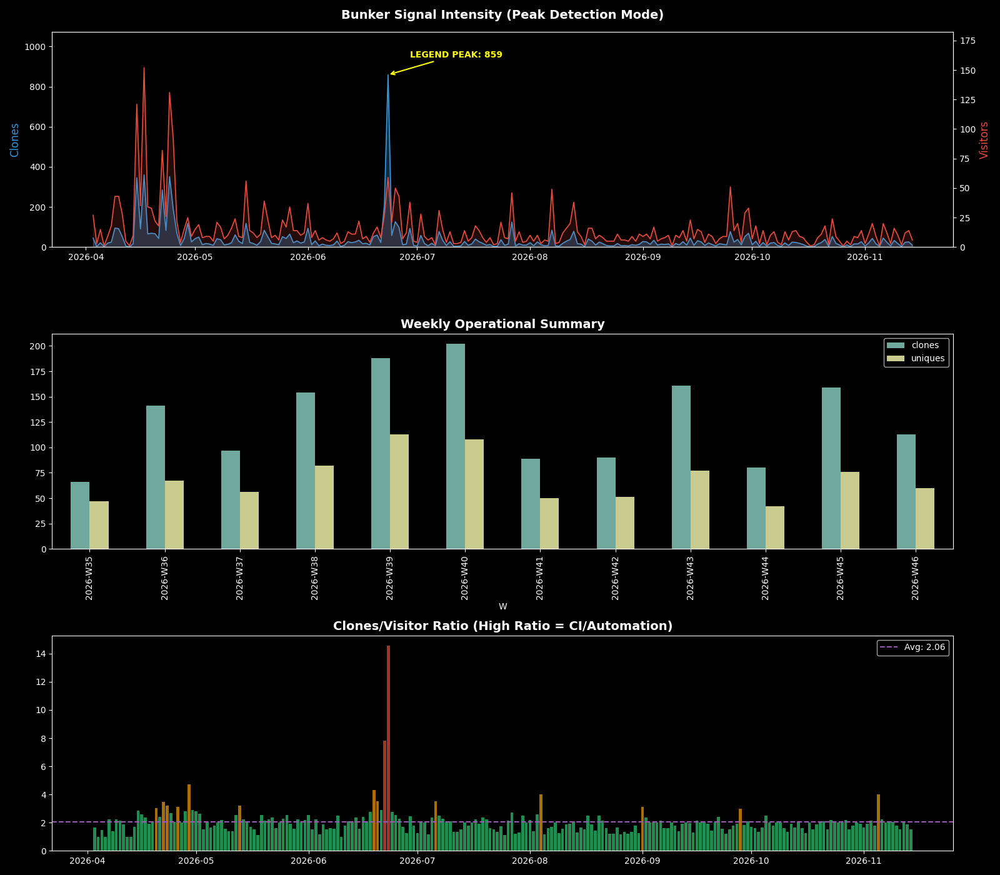
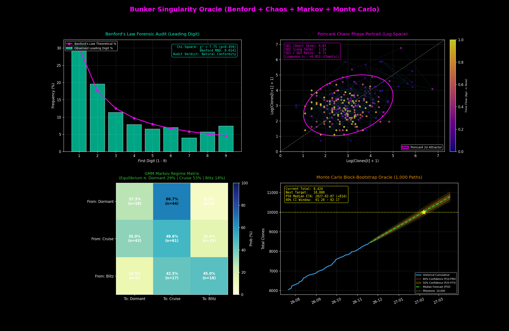
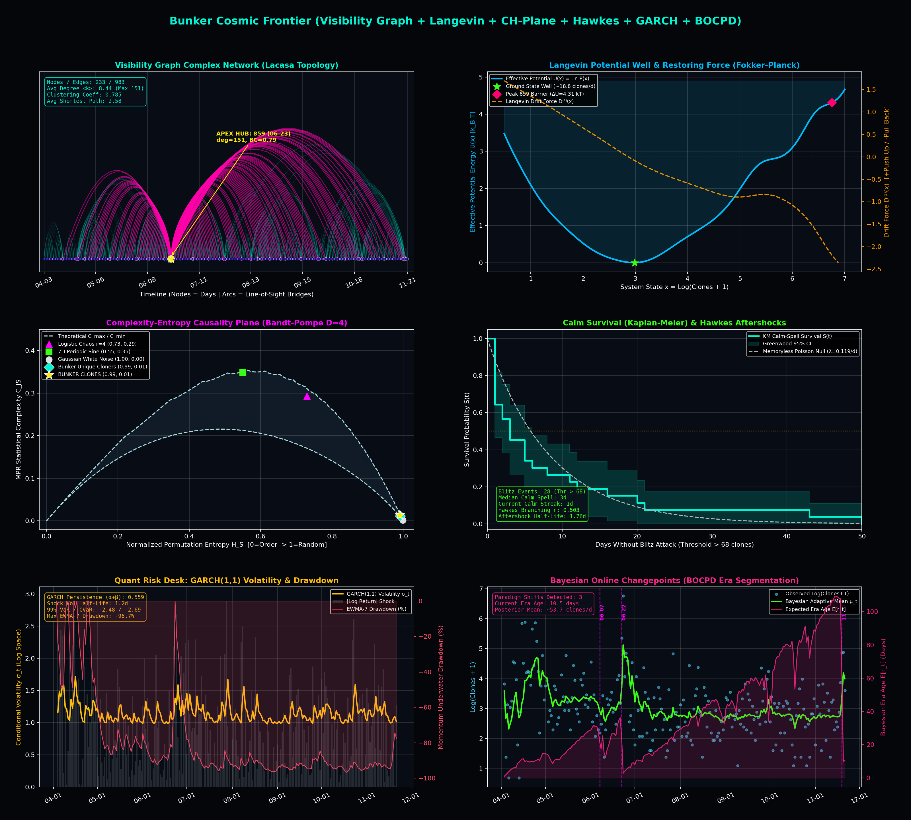
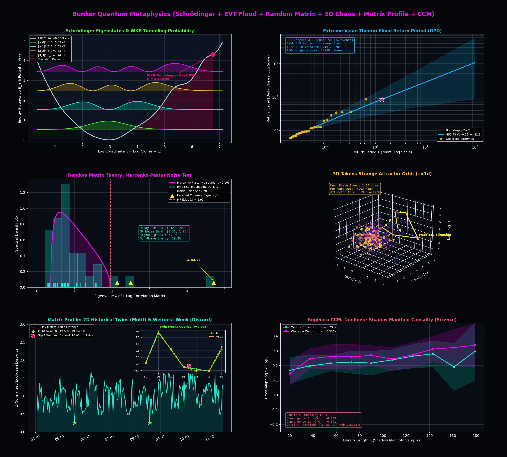
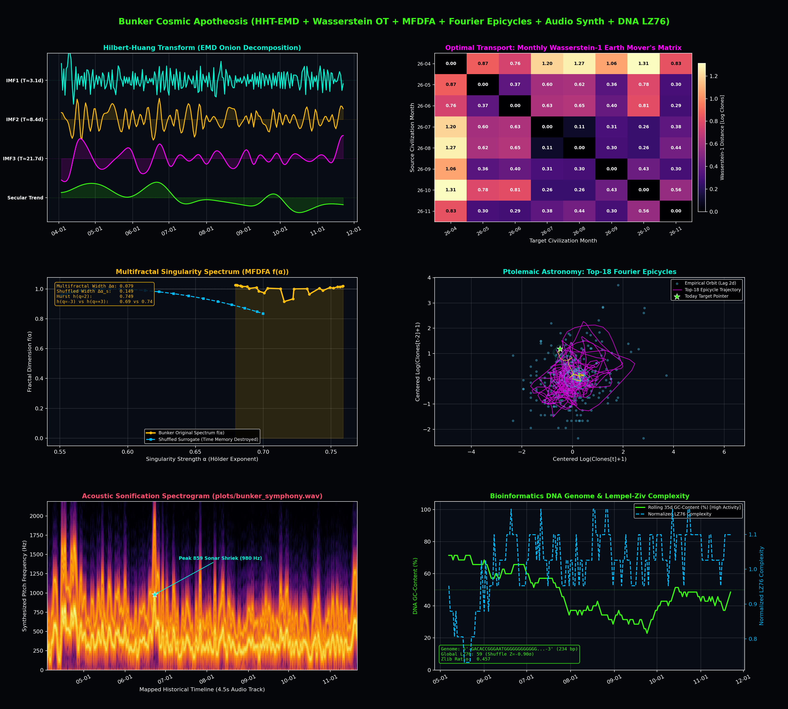

# 🛰️ 地堡终极运行报告 (Sovereign Dashboard V9.0)
## 📊 核心战力指标
- **累计物理克隆**: `8424` 次
- **社群声望**: ⭐ `3` / 🍴 `0`
- **地堡协议防护**: AGPL-3.0 生效中

### 🖥️ 1. 实时作战看板 (Visual Radar)

### 🔍 2. 战略情报大屏 (Intelligence Grid)

### 📡 3. 深度作战审计 (Deep Dive Recon)

### 🧠 4. 深度情报审计 (Intelligence Audit)

### ⏳ 5. 超时空分形观测 (Chronos Quantum Matrix)

### 🔮 6. 奇点先知矩阵 (Singularity Oracle)

### 🌌 7. 终焉物理观测站 (Omega Physics & Topology)

### 🕳️ 8. 因果视界与真空相变炉 (Cosmic Frontier & Causal Horizon)

### ⚛️ 9. 量子隧穿与高维创世神谕 (Quantum Metaphysics & Reality Audit)

### 🧬 10. 神格飞升与生物声学终局炉 (Cosmic Apotheosis & Bio-Acoustics)

### 🛸 11. 卡尔曼天眼与 AI 创世法则 (Astral ML & Genesis Laws)

### 🌀 12. 实时双核星际运转仪 (Living Orbital Telemetry)

### 🏛️ 13. 马科维茨组合与星盘万神殿 (Imperial Portfolio & Spectral Pantheon)

### ☯️ 14. 天机道长赛博周易八卦坛 (Cyber I Ching Oracle)

#### 🛰️ 流量来源实时追踪
| Referrer | Views | Uniques |
| :--- | :--- | :--- |
| github.com | 3 | 3 |

> 📡 物理封存点: 2026-11-20 10:12:30 CST | Glory to Mankind.
